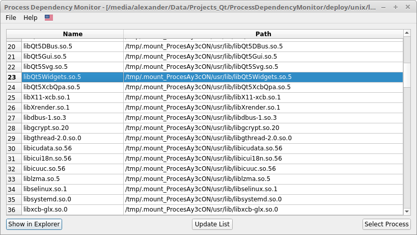
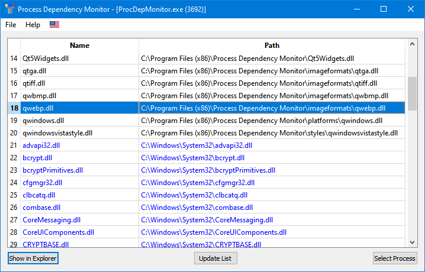

# Process Dependency Monitor
Comfortable cross-platform process dependency monitor with GUI based on Qt. Useful for the process of deploying your applications and controlling process dependencies, or determine which libraries a particular application uses

   
  
   
   
  

