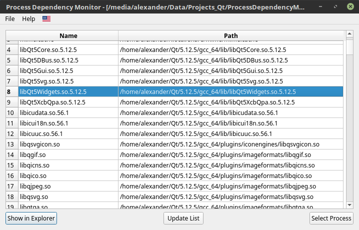

# Process Dependency Monitor
Comfortable cross-platform process dependency monitor with GUI based on Qt. Useful for the process of deploying your applications and controlling process dependencies

During development a template was used: [TemplateQtWidgets](https://github.com/3dproger/TemplateQtWidgets)

   
  
   
   
  

